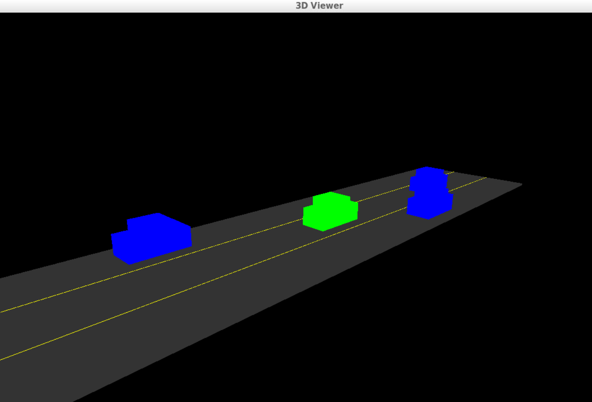

# LiDAR Obstacle Detection


### Welcome to the Sensor Fusion course for self-driving cars.

In this course we will be talking about sensor fusion, whch is the process of taking data from multiple sensors and combining it to give us a better understanding of the world around us. we will mostly be focusing on two sensors, lidar, and radar. By the end we will be fusing the data from these two sensors to track multiple cars on the road, estimating their positions and speed.

**Lidar** sensing gives us high resolution data by sending out thousands of laser signals. These lasers bounce off objects, returning to the sensor where we can then determine how far away objects are by timing how long it takes for the signal to return. Also we can tell a little bit about the object that was hit by measuring the intesity of the returned signal. Each laser ray is in the infrared spectrum, and is sent out at many different angles, usually in a 360 degree range. While lidar sensors gives us very high accurate models for the world around us in 3D, they are currently very expensive, upwards of $60,000 for a standard unit.

**Radar** data is typically very sparse and in a limited range, however it can directly tell us how fast an object is moving in a certain direction. This ability makes radars a very pratical sensor for doing things like cruise control where its important to know how fast the car infront of you is traveling. Radar sensors are also very affordable and common now of days in newer cars.

**Sensor Fusion** by combing lidar's high resoultion imaging with radar's ability to measure velocity of objects we can get a better understanding of the sorrounding environment than we could using one of the sensors alone.


## Installation

### Ubuntu 

```bash
$> sudo apt install libpcl-dev
$> cd ~
$> git clone https://github.com/udacity/SFND_Lidar_Obstacle_Detection.git
$> cd SFND_Lidar_Obstacle_Detection
$> mkdir build && cd build
$> cmake ..
$> make
$> ./environment
```

## Install PCL, C++ on Linux Ubuntu 16

Follow the link: https://larrylisky.com/2014/03/03/installing-pcl-on-ubuntu/

A few updates to the instructions above were needed: 
* libvtk needed to be updated to libvtk6-dev instead of (libvtk5-dev). The linker was having trouble locating libvtk5-dev while building, but this might not be a problem for everyone
* BUILD_visualization needed to be manually turned on, this link shows you how to do that: http://www.pointclouds.org/documentation/tutorials/building_pcl.php

### Windows 

http://www.pointclouds.org/downloads/windows.html

### MAC

#### Install via Homebrew
1. install [homebrew](https://brew.sh/)
2. update homebrew 
	```bash
	$> brew update
	```
3. add  homebrew science [tap](https://docs.brew.sh/Taps) 
	```bash
	$> brew tap brewsci/science
	```
4. view pcl install options
	```bash
	$> brew options pcl
	```
5. install PCL 
	```bash
	$> brew install pcl
	```

#### Prebuilt Binaries via Universal Installer
http://www.pointclouds.org/downloads/macosx.html  
NOTE: very old version 

#### Build from Source

[PCL Source Github](https://github.com/PointCloudLibrary/pcl)

[PCL Mac Compilation Docs](http://www.pointclouds.org/documentation/tutorials/compiling_pcl_macosx.php)

## Code Structure

- Top-level CMakeLists.txt
- Readme
- src
	- render
		- box.h - this file has the struct definitions for box objects
		- render.h
		- render.cpp - this file, along with the header, define the classes and methods for rendering objects.
	- sensors
		- data - this directory contains pcd data used in the course.
		- lidar.h - has functions using ray casting for creating pcd.
	- environment.cpp - the main file for using pcl viewer and processing and visualizing pcd.
	- processPointClouds.h
	- processPointClouds.cpp - Functions for filtering, segmenting, clustering, boxing, loading, and saving pcd.

## Compile the Code

```terminal
mkdir build
cd build
cmake ..
make
```

Once you have built an executable file, you can launch it by doing ./environment. Now you should see a window popping up that looks like the image above.

Here you have a simple highway simulator environment with the ego car in green in the center lane (thats your car), and the other traffic cars in blue. Everything is rendered using PCL with simple boxes, lines, and colors. You can move around your environment with the mouse. Try holding the left mouse button to orbit around the scene. You can also pan around the scene by holding the middle mouse button and moving. To zoom, use the middle scroll mouse button or the right mouse button while moving. Running this creates a 3D Viewer of a highway driving scenario. 



## Using the Lidar Object


